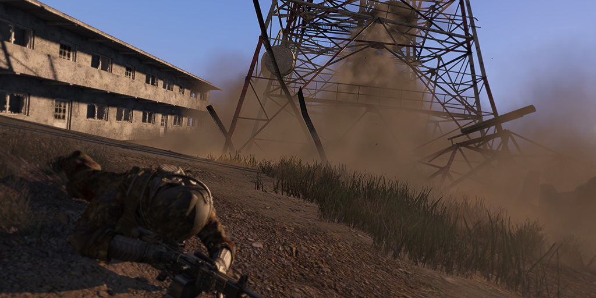

### COOP 05 Incommunicado

_Incommunicado_ is a small group co-op [ArmA 3](http://en.wikipedia.org/wiki/ARMA_3) mission set on the island of Altis. Advancing under cover of the early morning fog, you must infiltrate the island and knock out enemy communications in advance of a larger assault.

### Thanks

Thanks to:

* [farooqaaa](http://forums.bistudio.com/member.php?109050-farooqaaa), for [Farooq's Revive](http://forums.bistudio.com/showthread.php?155989-Farooq-s-Revive).
* [Meatball](http://forums.bistudio.com/member.php?99445-Meatball), whose mission _[Static Loop](http://forums.bistudio.com/showthread.php?159092-MP-COOP-2-8-WIP-Static-Loop)_ is the inspiration for _Incommunicado._
* [Shuko](http://forums.bistudio.com/member.php?57620-Shuko), for [SHK_startingPositionRandomizer](http://forums.bistudio.com/showthread.php?162423-SHK_startingPositionRandomizer) and [SHK_Taskmaster](http://forums.bistudio.com/showthread.php?160974-SHK_Taskmaster).
* [spunFIN](http://www.armaholic.com/users.php?m=details&id=12129&u=spunFIN), for his [AI Spawn Script Pack](http://www.armaholic.com/forums.php?m=posts&q=21499&d=0).
